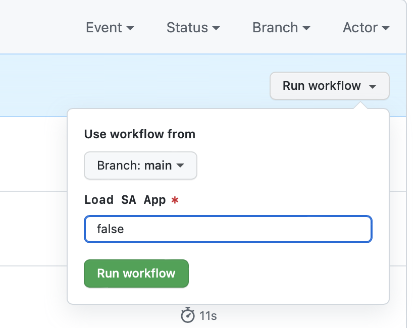

# speech-assistant-frontend

## Overview

Bahmni voice assistant UI

---

### Built With

* [React](https://reactjs.org/) ([TypeScript](https://www.typescriptlang.org)) - Front-end JS library
* [Jest](https://jestjs.io/) - JS testing framework
* [React Testing Library](https://testing-library.com/) - JS testing library for React components
* [yarn](https://yarnpkg.com/) - Yarn package manager
* [webpack](https://webpack.js.org/) - JS module bundler
* [ESLint](https://eslint.org/) - JS linter
* [Prettier](https://prettier.io/) - Code formatter
* [swc](https://swc.rs/docs/getting-started) - JS compiler
* [Github Actions](https://travis-ci.org/) - CI service

## Installation
---

### Prerequisites

* [Node](https://nodejs.org/en/download/)
* [Yarn](https://classic.yarnpkg.com/lang/en/docs/install/#mac-stable)
* [Git](https://git-scm.com/downloads)

### Setup

1. Clone the [speech-assistant-frontend](https://github.com/Bahmni/speech-assistant-frontend) repo.
```
git clone https://github.com/Bahmni/speech-assistant-frontend
```

2. Install dependencies in the root directory of the repo.
```
yarn install
```
3. To start the application
```
yarn serve
```

4. To build the application
```
yarn build
```

5. To test the application
```
yarn test
```

### Note:

 * There is a feature toggle functionality available. The Speech assistant microfrontend will not render if build workflow is triggered with false value.

   